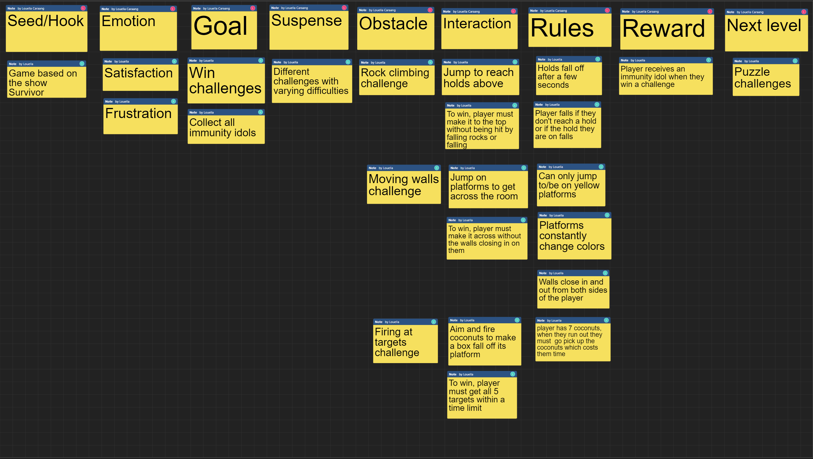
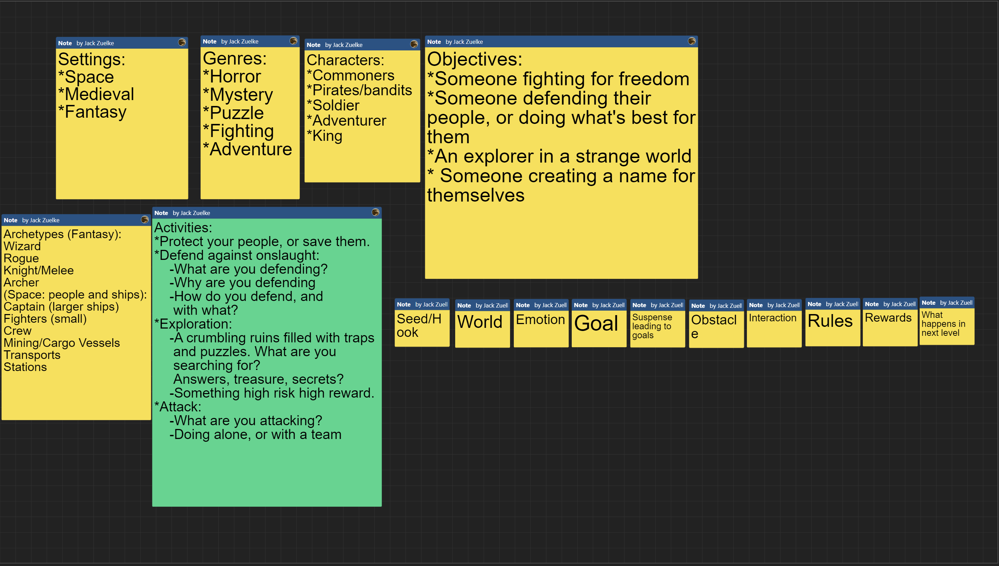
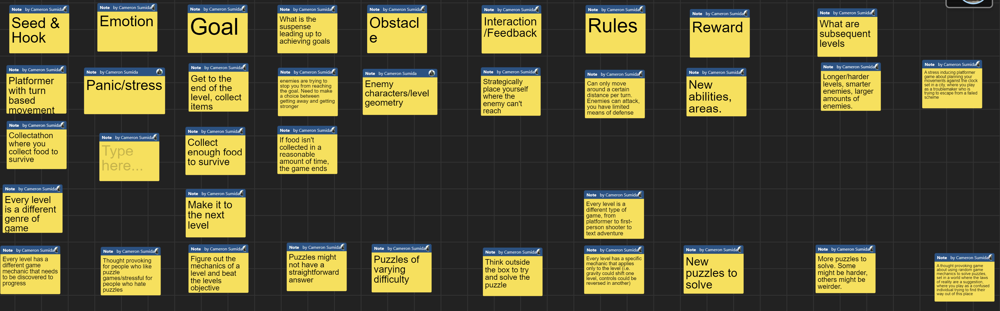
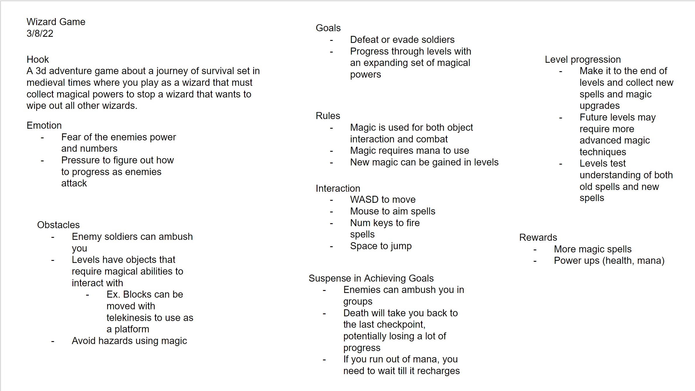

# Wizard Game

## Table of contents

* [Team Members](#team-members)
* [Overview](#overview)
* [Brainstorm](#brainstorm)
* [Design Sketches](#design-sketches)
* [Screenshots](#screenshots)
* [First Demo](#first-demo)
* [Final Demo](#final-demo)
* [Trello Board](#trello-board)

## Team Members
* Louella Carraang
  * ICS
  * Senior
* Jack Zuelke
  * ACM
  * Standing
* Cameron Sumida
  * ICS
  * Senior

## Who Did What
* Louella Carraang
  * Enemy AI
  * Player and enemy health
  * UI
* Jack Zuelke
  * Player and enemy models
  * Animations
  * Environment design
  * Textures
  * Puzzle design
  * Effects
* Cameron Sumida
  * Player controls
  * Camera controls
  * Telekinesis mechanics
  * Sound effects

## Overview
A physics based platformer where you play as a wizard and attempt to get to the goal. Use telekinesis to lift objects to progress through an area and defend yourself against enemy wizards.

## Brainstorm

### Louella

### Jack

### Cameron

### Group

## Design Sketches
Pictures

## Screenshots
Game Pictures

## First Demo
First Demo Video

## Final Demo

## Trello Board
[Trello board](https://trello.com/b/sTJ1Key2/project-management)
